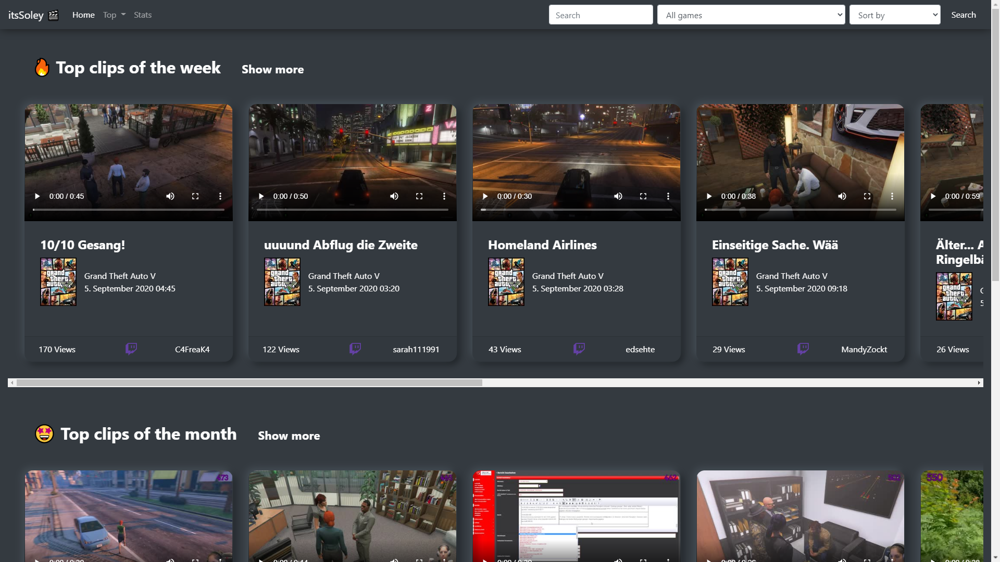
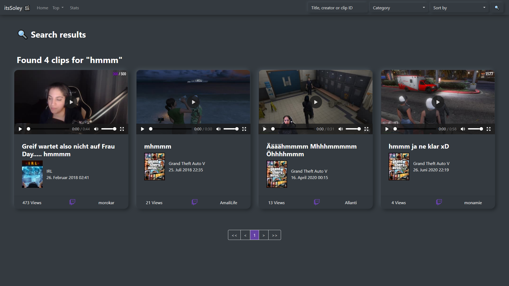
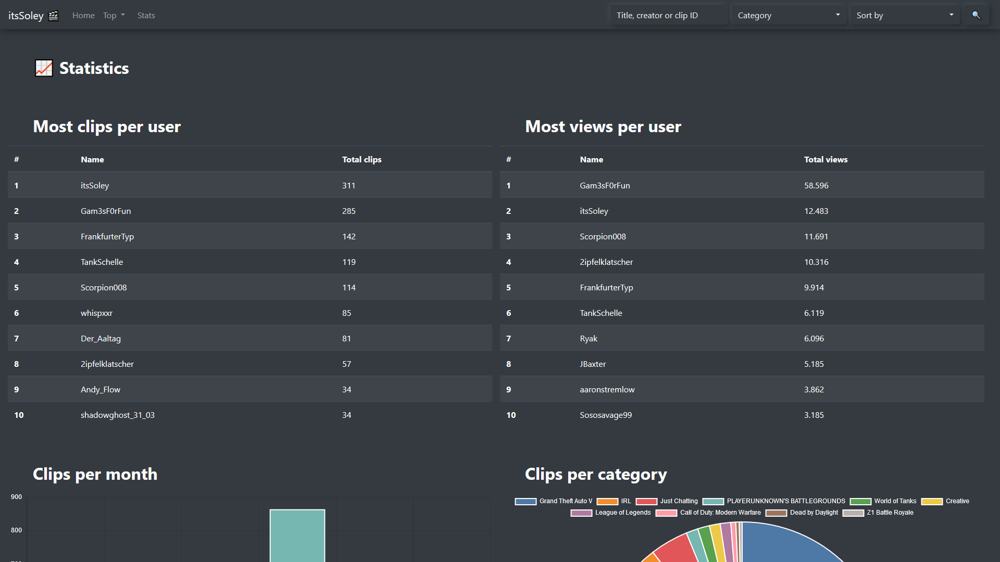
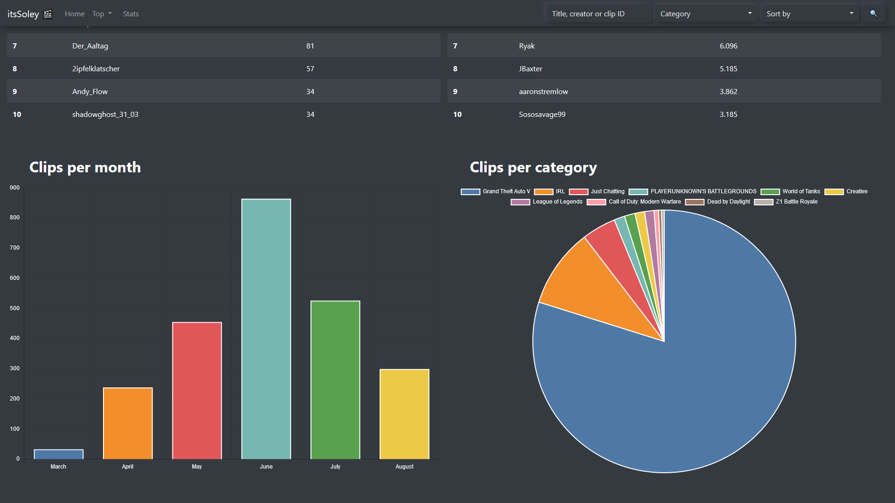

# Django-Twitch-Archive

This project creates a complete off side backup of the clips of a Twitch streamer. Top clips on the start page per week/month/ever, search function, sorting and statistics. [A live demo can be seen here](https://clips.itssoley.de/).

# Screenshots

### Font page


### Search function


### Statistics



# Installation process

## 1. Clone repo and cd into it

```
git clone https://github.com/seriousm4x/django-twitch-archive.git
cd django-twitch-archive
```

## 2. Get your .env file ready

Copy the "TEMPLATE.env" to ".env" and edit the file to your needs.

## 3. Create python virtual environment

```
python3 -m venv .venv
```

On Linux/Mac:
```
source .venv/bin/activate
```
On Windows:
```
.venv/Scripts/activate
```

## 4. Install python dependencies

```
pip install -r requirements.txt
```

## 5. Initialize database

```
python manage.py migrate
```

## 6. Create a superuser for the database

```
python manage.py createsuperuser
```

## 7. Add Twitch credentials to database

```
python manage.py runserver
```

Navigate to [http://localhost:8000/admin/](http://localhost:8000/admin/), login with your  account created in the previous step.

Click on "Twitch Settingss" and add a new entry. There are 5 fields, but you just need to fill the 3 marked fields saying "CHANGE THIS".

"So what do I paste there?"

"Broadcaster name" is the twitch streamer you want to save the clips from. For example "shroud". Make sure it matches exactly the twitch username.

"Client id" and "Client secret" can be gathered from [https://dev.twitch.tv/console/apps](https://dev.twitch.tv/console/apps). Create a new app, give it whatever name you like, add "http://localhost" as URL and select a category. Once done, twitch will give you a "Client-ID". Click on "New secret" and paste both into the django database and save it.

## 8. Add clips to database

```
python manage.py updateDB
```

This will search for all clips from the streamer. Not just Twitch's limit of 1000 clips but all clips available. Python will search for clips by week until the channel creation date is reached. This might take a while, since it's using the twitch api.

By now you can see the website at [http://localhost:8000/](http://localhost:8000/) when you run the server. But there are no clips or images yet. Just metadata.

## 9. Download clips and thumbnails

```
python manage.py download
```

This will download all data available in our database to the MEDIA_ROOT path.

## 10. Run the server

```
python manage.py runserver
```

Congrats, we are up and running for development or private use. If you want to publish your archive, go on reading.

# Going for production

If you deploy for production, you shouldn't use the default django key in your .env file. Go ahead and generate a new one.

```
python manage.py shell -c 'from django.core.management import utils; print(utils.get_random_secret_key())'
```

Edit and paste the generated key in your .env file under "SECRET_KEY".

Also set DEBUG=False and enter your domain under ALLOWED_HOSTS.

Run `python manage.py collectstatic` to copy the static files to your webroot.

Next, setup your reverse proxy to forward everything to django except our STATIC_ROOT and MEDIA_ROOT files.

## Caddy Server config

```
yourdomain.com {
    root * /var/www/
    @notStatic {
        not path /static/* /media/*
    }
    reverse_proxy @notStatic localhost:8000
    file_server
    encode gzip
}
```

## Run it as a system service

I attached a file [django-twitch-archive.service](django-twitch-archive.service). Copy it to `/etc/systemd/system/django-twitch-archive.service` and modify the user, group and paths.

Next, run 

```
sudo systemctl daemon-reload
sudo systemctl enable --now django-twitch-archive.service
```

## Automatically update database and download clips

I've created a cronjob which does this automatically every hour.

```
@hourly /home/max/git/django-twitch-archive/.venv/bin/python /home/max/git/django-twitch-archive/manage.py updateDB && /home/max/git/django-twitch-archive/.venv/bin/python /home/max/git/django-twitch-archive/manage.py download && /home/max/git/django-twitch-archive/.venv/bin/python manage.py collectstatic --noinput
```

## Change language

You can edit [clips/views.py](clips/views.py) where it says `class globalConf():`.

It's not the best solution, but will work for now.


# Todo

* Better css. My css is horible
* Dark mode toggle
