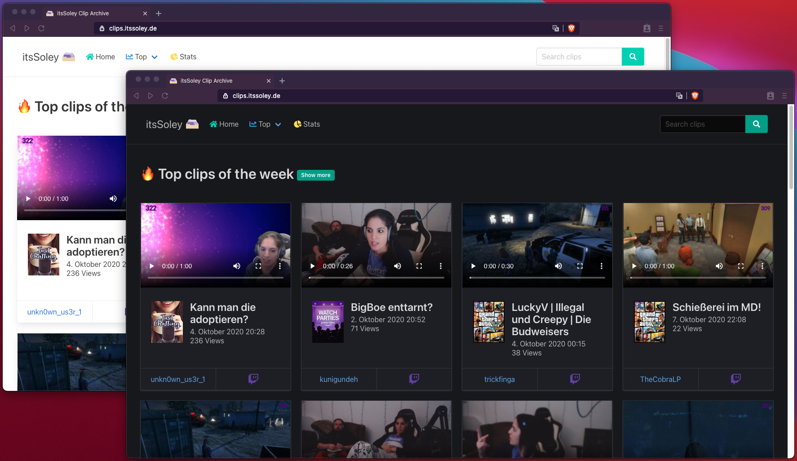
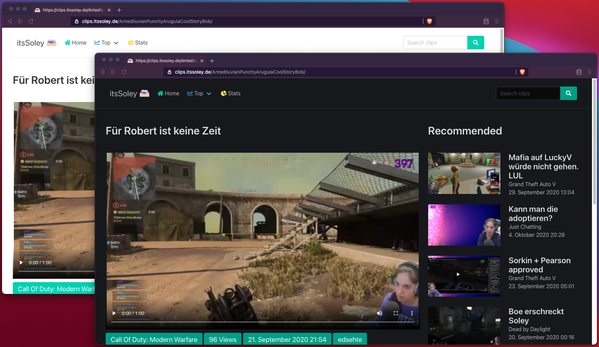
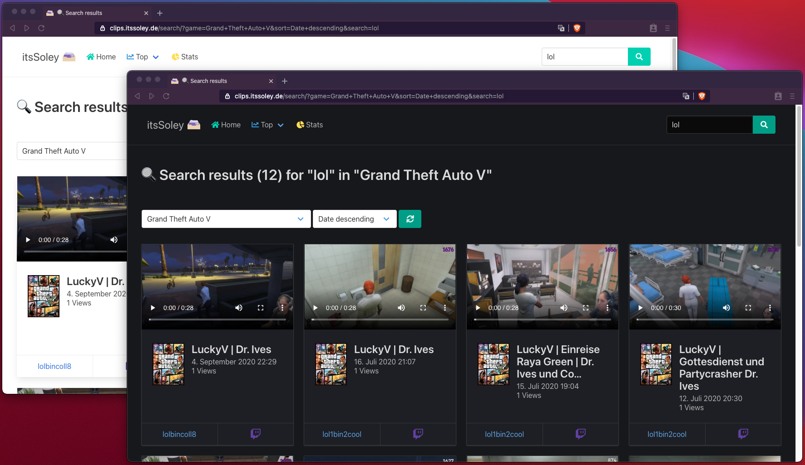
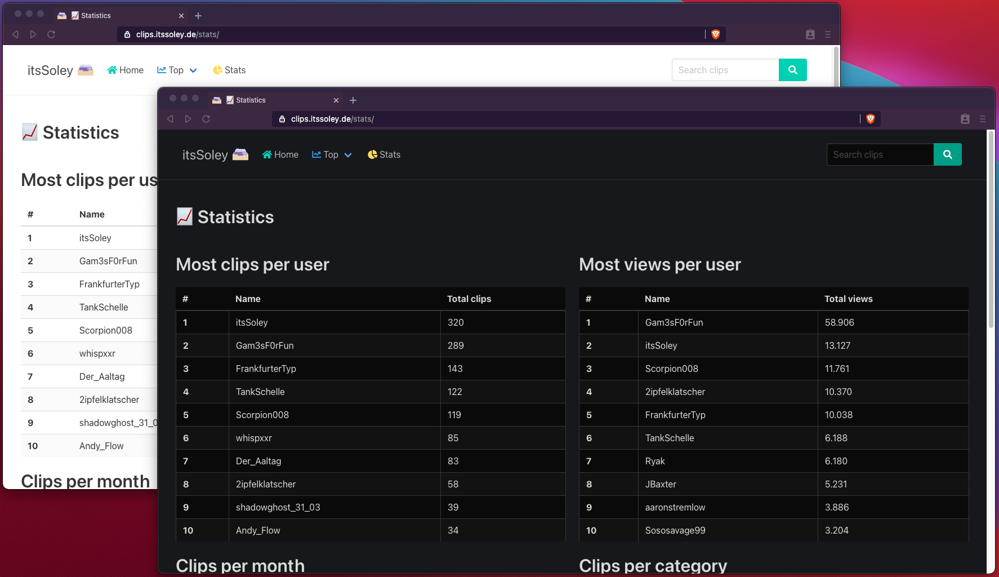

<p align="center">
    
    <p align="center">
        <strong>Twitch Clip Archive</strong>
    </p>
</P>

This project creates a complete off side backup of the clips of a Twitch streamer. Top clips on the start page per week/month/ever, search function, sorting and statistics. A [live demo](https://clips.itssoley.de/) can be seen here.

# Screenshots

<details>
<summary>Show me</summary>
<br>

Font page


Single clip


Search


Statistics

</details>

# Installation

```
git clone https://github.com/seriousm4x/django-twitch-archive.git
cd django-twitch-archive
```

Copy [TEMPLATE.env](TEMPLATE.env) to '.env' and edit it with your variables.

```
docker-compose up
```

Congrats, we are up and running for development or private use. Open up [http://localhost:8000](http://localhost:8000). If you want to publish your archive, go on reading.


Also, you shouldn't use the default django key in your .env file. Go ahead and generate a new one.

```
docker exec -it dta-web python manage.py shell -c 'from django.core.management import utils; print(utils.get_random_secret_key())'
```

Edit and paste the generated key in your .env file under DJANGO_SECRET_KEY.

Also set DJANGO_DEBUG=False and enter your domain under DJANGO_ALLOWED_HOSTS.

## Reverse proxy setup (Caddy)

A webserver with reverse proxy is required. You can just use the caddy example below or use your personal prefered reverse proxy, but make sure to exclude `/static/*` and `/media/*` from reverse proxying.

```
yourdomain.com {
    root * /var/www/
    @notStatic {
        not path /static/* /media/*
    }
    reverse_proxy @notStatic localhost:8000
    file_server
    encode gzip
}
```
